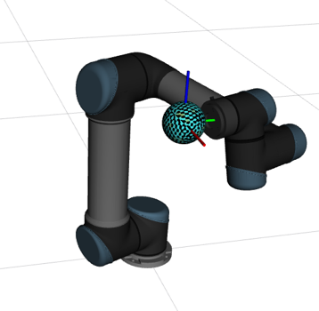
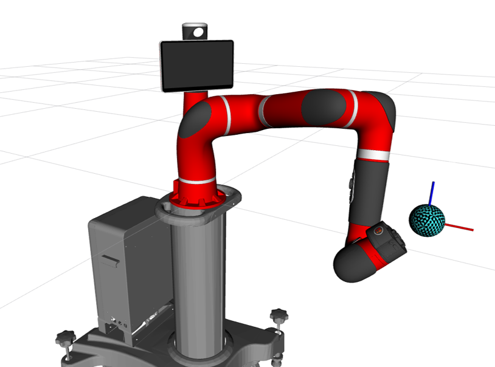

# ROS - pygradientpolytope

This repository includes nodes for generating and visualizing Cartesian Available : (1) Velocity Polytope (2) Force Polytope (3) Desired Polytope
(4) Performance Index - Capacity Margin in [Rviz](http://wiki.ros.org/rviz).

## Installation
This repository was tested on Universal Robot [UR5](https://www.universal-robots.com/products/ur5-robot/). The robot is controllled through an external PC with [ROS Noetic](http://wiki.ros.org/noetic) and Ubuntu 20.04 LTS. 
### Hardware requirements
* External PC. Our specifications are;
```
Intel® Core™ i7-10700K CPU @ 3.80GHz × 16
Intel® Core™ i9-10700K CPU @ 3.80GHz × 16 (Interactive Inverse Kinematics for the Serial Arm-  video for the paper)
RAM: 16 GB
Graphics: NVIDIA Corporation GP106GL [Quadro P2200]
```


### Software and Library Requirements 

* Ubuntu 20.04 LTS
* ROS Noetic
If you are new to ROS, go [here](http://wiki.ros.org/catkin/Tutorials/create_a_workspace) to learn how to create a catkin workspace. 
* Polytope. This is the source repository for polytope, a toolbox for geometric operations on polytopes in any dimension.
[Polytope](https://pypi.org/project/polytope/).
* [pykdl_utils](http://wiki.ros.org/pykdl_utils) Higher Level Python wrapper for PyKDL in ROS for Kinematic Solver
* Python native libraries [Scipy](https://scipy.org/), [Numpy](https://numpy.org/)
* Polygon ROS geometry messages for plotting in Rviz [jsk-ros-pkg](https://github.com/jsk-ros-pkg/jsk_recognition)
* Polytope ros message publisher forked and modified from Pycapacity Library [capacity_visual_utils](https://github.com/askuric/polytope_vertex_search/blob/master/ROS_nodes/panda_capacity/scripts/capacity/capacity_visual_utils.py)


## Toolbox in the Catkin workspace - ROS1
In a Terminal
```
$ cd ~/catkin_ws/src/
$ git clone https://gitlab.com/KeerthiSagarSN/rospygradientpolytope
```

## Library Installation - Only if not preinstalled

In a terminal
```
$ pip install sympy
$ pip install polytope
```
## Clone Sawyer Robot- Different from the Original Repo due to the offset in the tool center point to avoid Null in Jacobian
```
$ git clone https://github.com/KeerthiSagarSN/sawyer_robot
```

## Clone UR5 Robot Repository - Different from the Original Repo due to the offset in the tool center point to avoid Null in Jacobian

```
$ git clone https://github.com/KeerthiSagarSN/universal_robot
```


## Clone PyKDL - From OROCOS-KDL Repository - Latest Branch

```
$ git clone https://github.com/orocos/orocos_kinematics_dynamics.git
```

## Clone Pykdl - Kinematics Wrapper Repository - Edited for Python 3 and ROS Noetic Compatible
```
$ git clone https://github.com/KeerthiSagarSN/hrl-kdl.git
$ git checkout Noetic-devel
$ sudo apt-get install ros-noetic-urdf-parser-plugin
$ sudo apt-get install ros-noetic-urdfdom-py

```
## Clone Visualization Package Library - Rviz
```
$ git clone https://github.com/jsk-ros-pkg/jsk_visualization.git
```

## Catkin Build/ Catkin Make - Build & Source all repositories in Catkin Workspace
```
$ cd ..
$ catkin build
$ source devel/setup.bash
```

## IF you encounter CMAKE Error : Install all ROS- Dependencies - May take some time to install !! (Only when CMAKE Error !!)
```
$ sudo apt install ros-noetic-MISSING-PACKAGE

```

## ROS - Preliminary Dependencies - Install Only if required

```
$ sudo apt-get install ros-$ROS_DISTRO-robot-state-publisher ros-$ROS_DISTRO-joint-state-publisher
$ sudo apt-get install ros-$ROS_DISTRO-joint-state-publisher-gui
```

## To Visualize UR5 robot in Rviz
```
$ roslaunch ur_description view_ur5.launch 
```


## To Visualize Sawyer Robot in Rviz
```
$ roslaunch sawyer_description test_sawyer_description.launch
```

### Launch the IK Controller
#### UR Robot
```
$ roslaunch rospygradientpolytope launch_robot_ur.launch

```


#### or
#### Sawyer Robot
```
$ roslaunch rospygradientpolytope launch_robot_sawyer.launch
```



## Steps to start Interactive Inverse Kinematics
### Clone the interactive PyQT GUI repository and launch the QT panel
```
$ git clone https://gitlab.com/KeerthiSagarSN/inverse_kinematics_interactive_rviz.git
$ cd ..
$ catkin build
$ source devel/setup.bash
$ roslaunch inverse_kinematics_interactive_rviz inverse_kinematics_interactive_rviz.launch
```
##### 1. Click and drag the interactive sphere with axes in the Rviz window 
##### 2. Select Run IK button from the Interactive panel
##### 3. Click on Polytope:ON for visualizing the estimated capacity margin during optimization
##### 4. Polytope:Off To stop updating the polytope (Faster execution option)
##### 5. Click on Reset Button : After optimization termination for consecutive IK optimization

##### Interactive panel is in experimental phase and may lead to occasional crash. Please restart the node, when GUI crashes.

#### UR Robot


#### Sawyer Robot


## Module functions
### Python3 library functions independent of ROS
#### For computing desired or available/feasible velocity polytope faces and vertices
```
from rospygradientpolytope.visual_polytope import *
```
#### For computing all hyperplane parameters and estimated capacity margin
```
from rospygradientpolytope.polytope_functions import *
```
#### For computing analytical gradient of hyperplane parameters and estimated capacity margin for serial robot
```
from rospygradientpolytope.polytope_gradient_functions import *
```
### ROS Message to plot in Rviz
```
from rospygradientpolytope.polytope_ros_message import *
```

## To test capacity margin gradient (Sawyer Robot)
### Fix all joints and move only one-joint "test_joint" and visualize simultaneously numerical gradient and analytical gradient 
```
$ roslaunch rospygradientpolytope launch_robot_sawyer.launch
```

## To test capacity margin gradient (UR5 Robot)
### Fix all joints and move only one-joint "test_joint" and visualize simultaneously numerical gradient and analytical gradient 
```
$ roslaunch rospygradientpolytope launch_robot_ur.launch
```

## To generate workspace of the CDPR with different sigmoid slopes (4-cable, 2-DOF)
### Generate Wrench Feasible Workspace (WFW) by identifying where Capacity margin index = 0
```
$ python3 CDPR_workspace.py
```

## Simple First-order Gradient Descent Optimization (CDPR)
### Start from initial pose and use analytical gradient to reach pose with maximum capacity margin
```
$ python3 test_CDPR_Optimization.py
```
## Region-of-Interest Optimization (CDPR)
### Optimization to operate CDPR within a ROI with obstacle avoidance
```
$ python3 test_CDPR_Optimization.py
```
