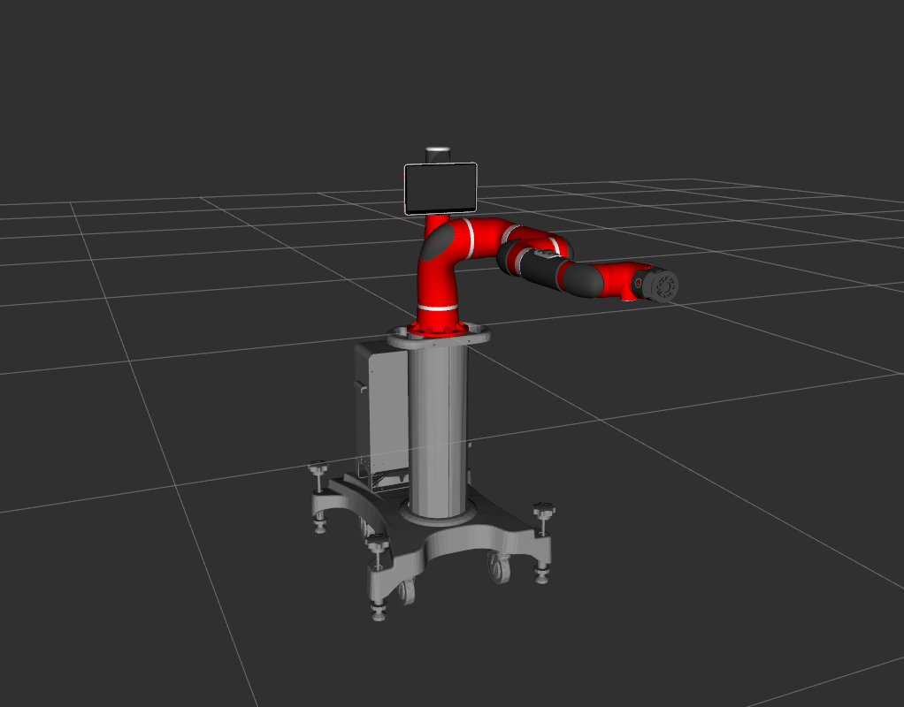

# ROS - pygradientpolytope

This repository includes nodes for generating and visualizing Cartesian Available : (1) Velocity Polytope (2) Force Polytope (3) Desired Polytope
(4) Performance Index - Capacity Margin in [Rviz](http://wiki.ros.org/rviz).

## Installation
This repository was tested on KUKA KR4 R600 Sixx robot with [KUKA RSI](https://docs.quanser.com/quarc/documentation/kuka_rsi_block.html) package installed in it. The robot is controllled through an external PC with [ROS Noetic](http://wiki.ros.org/noetic) and Ubuntu 20.04 LTS. 
### Hardware requirements
* External PC. Our specifications were;
```
ntel® Core™ i7-10700K CPU @ 3.80GHz × 16
RAM: 16 GB
Graphics: NVIDIA Corporation GP106GL [Quadro P2200]
```
* KUKA Robot. We used KUKA KR6 R700 Sixx.
* Gripper. 

### Software and Library Requirements 

* Ubuntu 20.04 LTS
* ROS Noetic
If you are new to ROS, go [here](http://wiki.ros.org/catkin/Tutorials/create_a_workspace) to learn how to create a catkin workspace. 
* KUKA RSI package installed in the KUKA robot.
* Polytope. This is the source repository for polytope, a toolbox for geometric operations on polytopes in any dimension.
[Polytope](https://pypi.org/project/polytope/).
* [pykdl_utils](http://wiki.ros.org/pykdl_utils) Higher Level Python wrapper for PyKDL in ROS for Kinematic Solver
* Python native libraries [Scipy](https://scipy.org/), [Numpy](https://numpy.org/)
* Polygon ROS geometry messages for plotting in Rviz [jsk-ros-pkg](https://github.com/jsk-ros-pkg/jsk_recognition)
* [KUKA experimental](https://gitlab.com/imr-robotics/kuka_experimental) Digital output interface is included in this repository. Official repository [here](https://github.com/ros-industrial/kuka_experimental). Instructions for KR C4 robot controller [here](https://github.com/ros-industrial/kuka_experimental/tree/indigo-devel/kuka_rsi_hw_interface/krl/KR_C4). 
* Polytope ros message publisher forked and modified from Pycapacity Library [capacity_visual_utils](https://github.com/askuric/polytope_vertex_search/blob/master/ROS_nodes/panda_capacity/scripts/capacity/capacity_visual_utils.py)


## Toolbox in the Catkin workspace - ROS1
In a Terminal
```
$ cd ~/catkin_ws/src/
$ git clone https://gitlab.com/KeerthiSagarSN/rospygradientpolytope
```

## Library Installation - Only if not preinstalled

In a terminal
```
$ pip install sympy
$ pip install polytope
```
## Clone Sawyer Robot
```
$ git clone https://github.com/RethinkRobotics/sawyer_robot
```
## Edit Sawyer Robot Launch File
```
Go to Folder: ~/catkin_ws/src/sawyer_robot/sawyer_description/launch/
Rename test_sawyer_description.launch.test ---> test_sawyer_description.launch
Open File: test_sawyer_description.launch
Set electric_gripper:=true --> electric_gripper:=false
```

## Clone UR5 Robot Repository - For ROS Noetic - /tree/melodic-devel-staging/ 

```
$ git clone https://github.com/ros-industrial/universal_robot.git
```


## Clone PyKDL - From OROCOS-KDL Repository - Latest Branch

```
$ git clone https://github.com/orocos/orocos_kinematics_dynamics.git
```

## Clone Pykdl - Kinematics Wrapper Repository - (Python 3 Incompatible  !!)
```
$ git clone https://github.com/gt-ros-pkg/hrl-kdl
```
## Clone Pykdl - Kinematics Wrapper Repository - Edited for Python 3 and ROS Noetic Compatible
```
$ git clone https://github.com/KeerthiSagarSN/hrl-kdl.git
$ git checkout Noetic-devel
$ sudo apt-get install ros-noetic-urdf-parser-plugin
$ sudo apt-get install ros-noetic-urdfdom-py

```
## Clone Visualization Package Library - Rviz
```
$ git clone https://github.com/jsk-ros-pkg/jsk_visualization.git
```

## Catkin Build/ Catkin Make - Build & Source all repositories in Catkin Workspace
```
$ cd ..
$ catkin build
$ source devel/setup.bash
```

## IF you encounter CMAKE Error : Install all ROS- Dependencies - May take some time to install !! (Only when CMAKE Error !!)
```
$ sudo apt install ros-noetic-MISSING-PACKAGE

```

## ROS - Preliminary Dependencies - Install Only if required

```
$ sudo apt-get install ros-$ROS_DISTRO-robot-state-publisher ros-$ROS_DISTRO-joint-state-publisher
$ sudo apt-get install ros-$ROS_DISTRO-joint-state-publisher-gui
```

## To Visualize UR5 robot in Rviz
```
$ roslaunch ur_description view_ur5.launch 
```
## To Visualize Sawyer Robot in Rviz
```
$ roslaunch sawyer_description test_sawyer_description.launch
```




## To test capacity margin gradient (Sawyer Robot)
### Fix all joints and move only one-joint "test_joint" and visualize simultaneously numerical gradient and analytical gradient 
```
$ roslaunch rospygradientpolytope launch_robot_sawyer.launch
```

## To test capacity margin gradient (UR5 Robot)
### Fix all joints and move only one-joint "test_joint" and visualize simultaneously numerical gradient and analytical gradient 
```
$ roslaunch rospygradientpolytope launch_robot_ur.launch
```

## To generate workspace of the CDPR with different sigmoid slopes (4-cable, 2-DOF)
### Generate Wrench Feasible Workspace (WFW) by identifying where Capacity margin index = 0
```
$ python3 CDPR_workspace.py
```

## Simple First-order Gradient Descent Optimization (CDPR)
### Start from initial pose and use analytical gradient to reach pose with maximum capacity margin
```
$ python3 test_CDPR_Optimization.py
```
## Region-of-Interest Optimization (CDPR)
### Optimization to operate CDPR within a ROI with obstacle avoidance
```
$ python3 test_CDPR_Optimization.py
```
